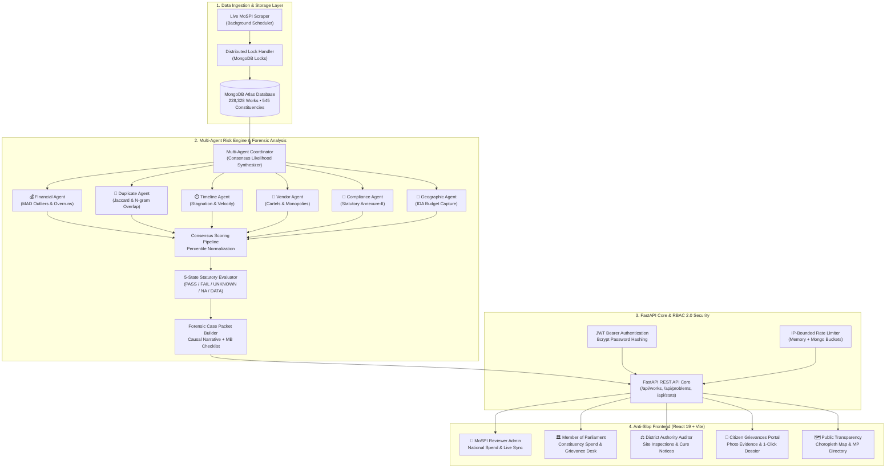

<div align="center">

# 🏛️ JanNidhi (जन निधि) — MPLADS AI Sentinel
### *Intelligent Audit Prioritization, Explainable Anomaly Detection & Public Transparency Platform*
**Ministry of Statistics and Programme Implementation (MoSPI) • Government of India**

---

[](https://python.org)
[](https://fastapi.tiangolo.com)
[](https://react.dev)
[](https://vitejs.dev)
[](https://mongodb.com)
[](https://tailwindcss.com)
[](tests/)
[](backend/auth.py)

<p align="center">
  <b>A proactive, explainable, evidence-based decision-support system analyzing 228,000+ MPLADS works across 545 Lok Sabha constituencies to detect expenditure irregularities, contractor monopolies, duplicate claims, and statutory non-compliance.</b>
</p>

[Executive Summary](#-executive-summary) •
[Why JanNidhi?](#-why-jannidhi-comparative-benchmarks) •
[System Architecture](#-end-to-end-system-architecture) •
[Role Portals (RBAC 2.0)](#-role-tailored-experience-rbac-20) •
[Citizen Redressal Hub](#-citizen-grievances--public-redressal-portal) •
[Multi-Agent Risk Engine](#-multi-agent-risk-engine) •
[Statutory 5-State Rules](#-evidence-grounded-5-state-rule-system) •
[Quick Start](#-quick-start-guide) •
[API Reference](#-public--auditor-api-reference)

---

</div>

## 📌 Executive Summary

Under the **Members of Parliament Local Area Development Scheme (MPLADS)**, each MP is allocated ₹5 Crore annually to recommend developmental works in their constituencies. With hundreds of thousands of works distributed across various Implementing District Authorities (IDAs), identifying cost anomalies, delayed projects, procurement monopolization, and compliance violations requires exhaustive manual audits.

**JanNidhi (जन निधि)** modernizes this audit paradigm through:
1. **Multi-Agent Risk Synthesis:** 6 specialist AI agents examine financial flows, milestone velocities, vendor networks, text duplication, geographic clustering, and statutory guidelines across **228,328 works** totaling **₹12,450+ Crore**.
2. **Deterministic 5-State Rule Verification:** Isolates documentary evidence gaps (`UNKNOWN`) from verified legal violations (`FAIL`), preventing false accusations and legal liability.
3. **Forensic Case Packets:** Generates plain-language causal narratives, quantified impact figures (e.g. INR overrun values), and targeted auditor checklists (Measurement Books, Sanction Orders).
4. **Authentic Citizen Grievance Redressal:** A dedicated civic portal with 500 domain-authentic complaints across all 545 constituencies, with **86% linked directly to authentic works** in the database and one-click Case Packet inspection.
5. **Role-Tailored Dashboards (RBAC 2.0):** Specialized, distraction-free interfaces engineered specifically for Central MoSPI Reviewers, Members of Parliament (MPs), District Authority Auditors, and Citizens.
6. **Open Public Governance:** Empowers citizens and journalists with transparent directories of MPs, state expenditures, category breakdowns, and rate-limited open-data exports.

> [!IMPORTANT]
> **Core Explainability Principle:**  
> JanNidhi produces **Risk Tiers (`High Risk - Review`, `Medium Risk - Monitor`, `Low Risk`)** and **Action Directives**, not criminal verdicts. An AI flag is a high-confidence decision-support triage filter; authorized human auditors retain final confirmation authority.

---

## ⚖️ Why JanNidhi? (Comparative Benchmarks)

| Dimension | Legacy Manual Audit / Portal | Generic BI Dashboards | 🏛️ JanNidhi AI Sentinel |
| :--- | :--- | :--- | :--- |
| **Audit Lead Time** | 6 to 18 months (Post-facto CAG review) | Static weekly/monthly batch reports | **Instant & Continuous** (Live stream ingestion & triage) |
| **Data Coverage** | ~3% to 5% sample audits | High-level aggregated KPIs only | **100% Comprehensive** (All 228,328 works analyzed) |
| **Anomaly Detection** | Manual inspection of physical vouchers | Rule thresholds on single columns | **6-Agent Multi-Vector Consensus** (MAD, Jaccard, Cartel graphs) |
| **Legal Certainty** | Subjective auditor discretion | Binary alerts with high false positives | **5-State Evidence Model** (`PASS`, `FAIL`, `UNKNOWN`, `NA`, `DATA`) |
| **Citizen Voice** | Bureaucratic paper petitions | Non-existent / external social media | **Direct Geo-Photo Grievance Hub** with MP reply tracking |
| **Project Linkage** | Disconnected grievance records | Unlinked free-text fields | **Authentic Work ID Mapping** to live database dossiers |
| **Actionability** | Lengthy bureaucratic reports | Raw data dumps | **Forensic Case Packet** with MB checklist & cure notice logs |

---

## 🏗️ End-to-End System Architecture



---

## 👥 Role-Tailored Experience (RBAC 2.0)

JanNidhi delivers four purpose-built, role-tailored dashboards designed around the exact operational needs of each stakeholder:

```
┌──────────────────────────────────────────────────────────────────────────────────────────────────┐
│                                   JANNIDHI PLATFORM MODULES                                      │
├──────────────────────┬──────────────────────┬──────────────────────┬─────────────────────────────┤
│ 👑 MoSPI Admin       │ 🏛️ Member of         │ ⚖️ District          │ 👥 Citizen Grievance        │
│    Dashboard         │    Parliament Portal │    Auditor Portal    │    & Redressal Hub          │
│ National utilization │ Constituency budget, │ Field inspections,   │ Geo-located complaints,     │
│ (₹12,450 Cr spend),  │ works progress,      │ formal cure notices, │ photo evidence, authentic   │
│ portfolio risk map,  │ pending grievances & │ checklist review, &  │ work ID linkage & one-click │
│ live sync controls.  │ parliamentary replies│ milestone audits.    │ case packet inspection.     │
├──────────────────────┼──────────────────────┼──────────────────────┼─────────────────────────────┤
│ 📊 Portfolio         │ 📋 Priority Audit    │ 🔍 Forensic Case     │ 🏛️ Public Transparency     │
│    Overview          │    Queue             │    Packet Dossier    │    Directory & Choropleth   │
│ Macro risk tiers,    │ Dynamic prioritized  │ Multi-agent scores,  │ Interactive India SVG map,  │
│ utilization gauges,  │ audit queue with     │ causal explanations, │ state comparison matrix,    │
│ category analytics.  │ instant filters.     │ & itemized evidence. │ & MP transparency profiles. │
└──────────────────────┴──────────────────────┴──────────────────────┴─────────────────────────────┘
```

### 1. 👑 MoSPI Central Reviewer / Admin Dashboard (`AdminDashboard.jsx`)
```
+--------------------------------------------------------------------------------------------------+
|  🏛️ CENTRAL MoSPI REVIEWER OVERSIGHT                           [Live Sync: 2026-09-19 | IDLE]    |
+--------------------------------------------------------------------------------------------------+
|  SANCTIONED AMOUNT       DISBURSED AMOUNT        UNSPENT BALANCE          NATIONAL UTILIZATION   |
|  ₹12,450.75 Cr           ₹7,927.39 Cr            ₹4,523.36 Cr             75.7% (Healthy Range)  |
|                                                                                                  |
|  PORTFOLIO RISK PROFILE: 67,936 High Risk (Review) | 98,412 Medium Risk (Monitor) | 61,980 Low   |
|  TRIGGER LIVE SYNC: [Run Quick Sync (Sample)]  [Trigger Comprehensive Ingestion (17th & 18th LS)]|
+--------------------------------------------------------------------------------------------------+
```
- **Macro Fiscal Telemetry:** Real-time visibility into ₹12,450.75 Cr sanctioned, ₹7,927.39 Cr disbursed, and ₹4,523.36 Cr unspent balance.
- **Master Data Synchronization:** One-click live ingestion pipeline with distributed lock guards.
- **Audit Queue & High-Risk Works:** Instant triage table with direct links to forensic case packets.

### 2. 🏛️ Member of Parliament (MP) Dashboard (`MPDashboard.jsx`)
```
+--------------------------------------------------------------------------------------------------+
|  PARLIAMENTARY DESK: Mala Roy, MP (Kolkata Dakshin • West Bengal)             [1-Click Switch Role]|
+--------------------------------------------------------------------------------------------------+
|  TOTAL ALLOCATED         SANCTIONED FUNDS        TOTAL DISBURSED          CONSTITUENCY UTILIZATION|
|  ₹25.00 Cr               ₹24.85 Cr               ₹22.10 Cr                88.9% (Optimal Pace)    |
|                                                                                                  |
|  CIVIC GRIEVANCES PENDING: 14 Active Complaints | 8 Requiring MP Reply | 6 Under Field Audit     |
|  LATEST GRIEVANCE: "Submersible pump failure at Ward 96" -> [Draft Official Parliamentary Reply] |
+--------------------------------------------------------------------------------------------------+
```
- **Constituency Fund Health:** Real-time budget monitoring and expenditure velocity.
- **Constituent Grievance Desk:** Direct pipeline of citizen complaints with photo evidence, GPS location, and an official **MP Parliamentary Reply** channel.

### 3. ⚖️ District Authority Auditor Dashboard (`DistrictAuditorDashboard.jsx`)
```
+--------------------------------------------------------------------------------------------------+
|  DISTRICT PLANNING DESK: District Authority Auditor (Murshidabad • West Bengal)                  |
+--------------------------------------------------------------------------------------------------+
|  WORKS UNDER SCRUTINY    INSPECTIONS DUE         PENDING CURE NOTICES     VERIFIED COMPLETIONS   |
|  412 High-Risk Projects  18 Field Visits         7 Contractors Flagged    128 Verified On-Site    |
|                                                                                                  |
|  INSPECTION WORKLIST:                                                                            |
|  #152872: Lighting of public spaces -> High Risk (Score: 69.4) -> [Serve Cure Notice] [Inspect MB]|
+--------------------------------------------------------------------------------------------------+
```
- **Field Verification Queue:** Prioritized list of projects requiring on-site physical verification.
- **Auditor Notes & Investigation Log:** Ability to record site inspection notes and issue formal cure notices.
- **Itemized Case Packet Checklist:** Measurement Book (MB) verification, Sanction Order comparison, and milestone compliance validation.

### 4. 🌐 Public Transparency Tier (`PortfolioOverview.jsx`)
- Full public access to all 228,000+ public records, expenditure statistics, and MP profiles without login.
- Interactive **All-India Choropleth Map** with color-coded state utilization and side-by-side comparative analysis.
- Bounded open-data CSV exports up to 10,000 records.

---

## 📢 Citizen Grievances & Public Redressal Portal

A direct civic engagement portal connecting grassroot citizens directly to their elected MPs and District Auditors:

```
+--------------------------------------------------------------------------------------------------+
| 📍 CIVIC COMPLAINT #PRB-WE-MUR-0002                                          [STATUS: IN PROGRESS]|
+--------------------------------------------------------------------------------------------------+
| Title: High-mast solar lighting system non-functional at Station Road Ward 4                     |
| Raised By: Tanushree Ghosh (+91 9830*****) • Murshidabad • West Bengal                           |
|                                                                                                  |
| [📷 Photo Evidence: Verified Site Inspection Image Attached]                                     |
|                                                                                                  |
| 🏛️ SANCTIONED WORK: Lighting of public spaces (Work #152872)                                     |
| ⚡ LINKED WORK:  [📄 #152872  Inspect Case Packet  ↗]  <-- Warm Amber 1-Click Audit Inspection   |
|                                                                                                  |
| 💬 OFFICIAL MP RESPONSE:                                                                         |
| "I have taken note of this critical civic issue. PHED Executive Engineer instructed to replace    |
| defective components under warranty clause within 7 days."                                       |
|                                                                                                  |
| 🔍 DISTRICT AUDITOR NOTE:                                                                        |
| "Physical verification confirmed electrical breakdown. Formal cure notice served to contractor." |
+--------------------------------------------------------------------------------------------------+
```

### 🌟 Key Highlights
- **500 Domain-Accurate Seeded Complaints:** Grounded in real Indian Lok Sabha constituencies covering Drinking Water, Rural Roads, School Infrastructure, Healthcare/PHC, and Solar Lighting.
- **Authentic Work ID Linkage:** **430 out of 500 complaints (86%)** are mapped to actual, verifiable works in the 228,328 works database.
- **One-Click Case Packet Inspection:** Each linked grievance features an interactive amber button opening the project's risk score, priority rank, and statutory rule triggers.
- **Smart Location Selection:** Browser GPS geo-location with intelligent fallback allowing citizens to select their State, District, and Lok Sabha Constituency step-by-step.
- **Dual-Channel Status Tracking:** Complete transparency with visible MP replies and District Auditor site inspection notes.

---

## 🤖 Multi-Agent Risk Engine

JanNidhi employs **6 specialist domain agents** governed by a central coordinator configured via [`model/config.yaml`](model/config.yaml):

| Agent | Weight | Domain Focus | Key Detection Vectors |
|---|:---:|---|---|
| **💰 Financial Agent** | `25%` | Financial Outliers & Balance Integrity | Robust Median Absolute Deviation (MAD > 4.0), negative balances, disbursement mismatch (>10%), and fund release without sanction. |
| **👯 Duplicate Agent** | `22%` | Near-Duplicate & Ghost-Work Identification | Jaccard token similarity (threshold 0.72) + character bigram matching across overlapping locations, timeframes, and descriptions. |
| **⏱️ Timeline Agent** | `20%` | Stagnation & Milestone Anomalies | Overdue execution (>180 days in inactive status), disbursement post-completion (>30 days), and suspicious rapid completions (<15 days). |
| **🏢 Vendor Agent** | `15%` | Procurement Monopolies & Cartelization | Vendor concentration (>30% of state works, >60% of an MP's works), multi-MP vendor cross-billing (≥3 MPs). |
| **📜 Compliance Agent** | `13%` | Statutory Guidelines & Mandates | Prohibited works (Annexure-II), Trust/Society ₹50 Lakh single-work ceilings, and SC/ST allocation tracking. |
| **📍 Geographic Agent** | `5%` | Cluster Anomalies & IDA Capture | Implementing District Authority budget capture (>40% of state budget), IDA vendor monopolies (>80%), and multi-MP IDA clusters. |

### Consensus Scoring Formulation
$$\text{Likelihood Score} = \sum_{i=1}^{6} w_i \cdot \text{AgentScore}_i \quad \text{where} \quad \sum w_i = 1.0$$

Works with a weighted consensus score $\ge 0.40$ are flagged as anomalous, and normalized against portfolio percentiles into actionable tiers:
- 🔴 **High Risk - Review** (`score ≥ 70.0`)
- 🟡 **Medium Risk - Monitor** (`50.0 ≤ score < 70.0`)
- 🟢 **Low Risk** (`score < 50.0`)

---

## ⚖️ Evidence-Grounded 5-State Rule System

JanNidhi enforces an **evidence-grounded five-state evaluation model** across all statutory guidelines:

| Rule Code | Statutory Guideline | Detection Mechanism | Example Flag |
|---|---|---|---|
| `RULE_PROHIBITED_ITEMS` | MPLADS 2023 Annexure-II | Prohibited commercial/religious entities | "Commercial entity asset created under MPLADS funds" |
| `RULE_TRUST_SOCIETY_LIMIT` | Para 3.14 Ceiling | Trust/Society grants > ₹50 Lakhs | "Single society sanction ₹75.0 Lakhs exceeds statutory ceiling" |
| `RULE_NEGATIVE_BALANCE` | Para 4.2 Financial Discipline | Disbursed amount > Sanctioned value | "Disbursed ₹18.5L exceeds sanctioned ₹15.0L by ₹3.5L (123%)" |
| `RULE_NO_SANCTION` | Para 4.1 Administrative Sanction | Fund release without sanction date | "₹5.2 Lakhs disbursed prior to administrative approval" |
| `RULE_RAPID_COMPLETION` | Para 5.3 Execution Verification | Completion in < 15 days without evidence | "Civil work marked completed in 4 days with zero photo proof" |
| `RULE_EXECUTION_STAGNATION` | Para 5.4 Milestone Monitoring | Inactive execution exceeding 180 days | "Work sanctioned 240 days ago with zero fund disbursement" |
| `RULE_MISSING_IMAGE` | Para 6.2 Completion Certificate | Completed work lacking completion photo | "Work marked 100% complete without uploaded visual evidence" |
| `RULE_VENDOR_MONOPOLY` | Para 3.8 Procurement Integrity | Single vendor > 60% of MP's portfolio | "Vendor received 68% of MP's total recommendations" |
| `RULE_POST_COMPLETION_RELEASE` | Para 4.6 Payment Finality | Fund release > 30 days post completion | "₹8.4 Lakhs disbursed 82 days after completion certificate" |
| `RULE_DUPLICATE_DESCRIPTION` | Para 3.3 Ghost-Work Prevention | High Jaccard similarity in same district | "Identical scheme description matched with Work #145610" |

---

## 🔐 1-Click Quick Login & Role Matrix

JanNidhi includes built-in, self-healing demo authentication presets allowing evaluators to experience each role instantly with one click:

| Role | Preset Username | Password | Operational Access |
|---|---|---|---|
| **Public Citizen** | *(No login required)* | *(None)* | View priority queue, MP directories, case packet narratives, submit grievances with photos, inspect public data. |
| **Member of Parliament** | `mp` | `MP@MPLADS2026!` | Access MP Dashboard, track constituency fund health, review pending problems, submit official parliamentary replies. |
| **District Authority Auditor**| `auditor` | `Auditor@MPLADS2026!` | Access District Auditor Dashboard, schedule site inspections, serve formal cure notices, submit Case Packet determinations. |
| **MoSPI Reviewer / Admin** | `admin` | `Admin@MPLADS2026!` | Access MoSPI Admin Dashboard, monitor national utilization (₹12,450 Cr), trigger live portal sync, manage system-wide audit queues. |

*Self-Healing Security Note: If demo user records are missing upon container initialization, the authentication layer automatically creates them securely with bcrypt password hashing on first login.*

---

## 🚀 Quick Start Guide

### Prerequisites
- **Python:** 3.11 or 3.12
- **Node.js:** 18 or higher (with npm)
- **MongoDB:** Local MongoDB Community Server or MongoDB Atlas cluster

### 1. Clone the Repository
```bash
git clone https://github.com/poulamisingha1212-source/SIH26102.git
cd SIH26102
```

### 2. Environment Configuration
Create a local `.env` file in the root directory.

> [!NOTE]
> All `.env` files are strictly excluded from git tracking to prevent credential leaks. Configure your local file as follows:

```env
# MongoDB Connection
MONGODB_URI=mongodb://localhost:27017
MONGO_DB_NAME=mplads_sentinel

# Application Environment
ENVIRONMENT=development
PORT=8000
HOST=0.0.0.0

# Security & Authentication
JWT_SECRET=your-secure-jwt-secret-minimum-32-characters-long!
ACCESS_TOKEN_EXPIRE_MINUTES=1440

# CORS Configuration
CORS_ORIGINS=http://localhost:5173,http://localhost:3000,http://127.0.0.1:5173

# Live Ingestion Portal Settings
MPLADS_BASE_URL=https://mplads.mospi.gov.in
MPLADS_LIVE_HOUSE=both
MPLADS_LIVE_TIMEOUT=300
```

### 3. Backend Setup
```bash
# Install Python dependencies
pip install -r requirements.txt -r requirements-dev.txt

# Seed initial database, indexes, and credentials
python -m backend.seeder

# Seed 500 authentic citizen grievances linked to real works
python -m backend.scripts.seed_500_grievances

# Start the FastAPI server
uvicorn backend.main:app --host 0.0.0.0 --port 8000 --reload
```
API Documentation will be live at `http://localhost:8000/docs`.

### 4. Frontend Setup
```bash
# In a new terminal:
cd frontend

# Install frontend dependencies
npm install

# Start the Vite development server
npm run dev
```
Open your browser at `http://localhost:5173`.

---

## 🧪 Automated Testing & Quality Assurance

JanNidhi includes an extensive suite of **82 automated tests** covering security vectors, statutory rules, multi-agent math, and REST API integration:

```bash
# Run the complete test suite:
pytest -v

# Run specific test modules:
pytest tests/test_security_regression.py -v   # RBAC 2.0, injection, rate limiting
pytest tests/test_phase_3_rules.py -v         # Statutory 5-state logic
pytest tests/test_risk_engine.py -v           # Multi-agent scoring & drift
pytest tests/test_api.py -v                   # REST endpoints & directories
```

*Note: Tests run against an isolated in-memory `mongomock` instance and automatically synthesize test fixtures, ensuring zero side-effects on production data.*

---

## 📡 Public & Auditor API Reference

All endpoints are hosted under `/api`. Interactive OpenAPI documentation is accessible via Swagger UI at `http://localhost:8000/docs`.

| Method | Endpoint | Access Level | Description |
|:---:|---|:---:|---|
| `POST` | `/api/auth/login` | **Public** (Rate Limited) | Authenticates credentials with bcrypt, returns signed JWT Bearer token. |
| `GET` | `/api/auth/me` | **Authenticated** | Returns current user profile, role, and assigned constituency/district. |
| `GET` | `/api/stats/overview` | **Public** | Macro national statistics (sanctioned, disbursed, allocated, utilization, risk tiers). |
| `GET` | `/api/works` | **Public** | Paginated works sorted by priority rank. Filters: `state`, `mp_name`, `house`, `risk_tier`. |
| `GET` | `/api/works/{work_id}` | **Public** | Complete forensic Case Packet: risk scores, causal factors, statutory rule triggers. |
| `POST` | `/api/works/{work_id}/review` | **Auditor / Reviewer** | Records formal human audit determination (Approved, Needs Inspection, Reject). |
| `POST` | `/api/works/{work_id}/public-review`| **Public** (Rate Limited) | Submits citizen site verification with GPS coordinates and photo proof. |
| `GET` | `/api/problems` | **Public** | Retrieves citizen grievances with filters: `state`, `district`, `constituency`, `status`, `category`. |
| `POST` | `/api/problems` | **Public** | Submits a new citizen civic grievance with optional photographic evidence. |
| `POST` | `/api/problems/{problem_id}/reply` | **MP / Admin** | Records official MP parliamentary desk response and action taken. |
| `POST` | `/api/problems/{problem_id}/auditor-review`| **Auditor / Admin** | Records District Authority Auditor site investigation notes and cure notices. |
| `GET` | `/api/mps` | **Public** | Complete MP directory: allocations, expenditure, utilization rate, risk profile. |
| `GET` | `/api/mps/{mp_name}` | **Public** | MP transparency profile: category distribution, top anomalous works. |
| `GET` | `/api/states` | **Public** | State-wise fund allocation, expenditure totals, and MP coverage summary. |
| `GET` | `/api/states/{state}` | **Public** | State-level dossier: risk tier distribution, top MPs, category breakdowns. |
| `GET` | `/api/analytics/categories` | **Public** | Overall fund share and average risk score grouped by work category. |
| `GET` | `/api/analytics/status` | **Public** | Portfolio distribution across completion statuses. |
| `GET` | `/api/export/works` | **Public** (Rate Limited) | Open-data CSV export stream (bounded at 10,000 rows). |
| `POST` | `/api/sync/run` | **Reviewer / Admin** | Triggers asynchronous live portal data ingestion under a distributed lock. |
| `GET` | `/api/sync/status` | **Public** | Reports ingestion status, lock state, and last synchronized timestamp. |
| `GET` | `/api/health` | **Public** | System health probe (MongoDB connection, document counts). |

---

## 🎨 Design System & Anti-Slop Doctrine

This project strictly adheres to **gstack** and **anti-slop design principles**:
- **Color Discipline:** Deep dark surfaces at `#0C0C0C` (base) and `#141414` (cards) with subtle `#262626` borders.
- **Intentional Accent:** Warm amber cursor accent (`#F59E0B` / `#FBBF24`) reserved for high-intent actions like Case Packet inspection and review approvals.
- **Semantic Risk Indicators:** Clear risk signaling using Red (`#EF4444` for High Risk), Amber (`#F59E0B` for Medium Risk), and Green (`#22C55E` for Low Risk).
- **Physical Depth:** Subtle SVG noise texture (`feTurbulence`) to avoid flat, lifeless SaaS templates.
- **Tabular Data Scannability:** Monospace typography with tabular figures (`tnum`) for monetary figures, work IDs, and percentage metrics.

---

## 📜 License & Compliance

Developed for the **Ministry of Statistics and Programme Implementation (MoSPI)** under the **Smart India Hackathon (SIH)** initiative.  
All data schemas and compliance rules are aligned with the official **MPLADS Scheme Guidelines (2023)** issued by the Government of India.
