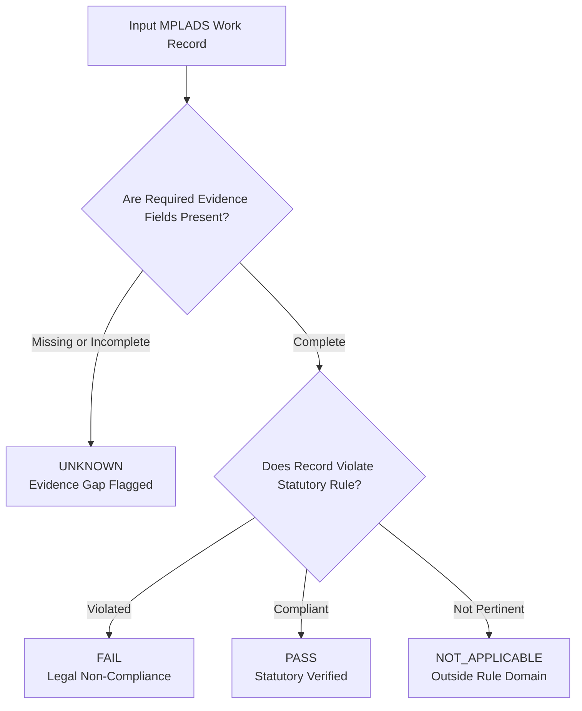

<div align="center">

# 🏛️ JanNidhi (जन निधि) — MPLADS AI Sentinel
### *Intelligent Audit Prioritization, Explainable Anomaly Detection & Public Transparency Platform*
**Ministry of Statistics and Programme Implementation (MoSPI) • Government of India**

---

[](https://python.org)
[](https://fastapi.tiangolo.com)
[](https://react.dev)
[](https://vitejs.dev)
[](https://mongodb.com)
[](https://tailwindcss.com)
[](tests/)
[](backend/auth.py)

<p align="center">
  <b>A proactive, explainable, evidence-based decision-support system analyzing 228,000+ MPLADS works across 545 Lok Sabha constituencies to detect expenditure irregularities, contractor monopolies, duplicate claims, and statutory non-compliance.</b>
</p>

[Key Innovations](#-key-innovations) •
[Role-Tailored Dashboards](#-role-tailored-experience-rbac-20) •
[Citizen Grievance Redressal](#-citizen-grievances--public-redressal-portal) •
[Multi-Agent Risk Engine](#-multi-agent-risk-engine) •
[Statutory 5-State Rules](#-evidence-grounded-5-state-rule-system) •
[API Reference](#-public--auditor-api-reference) •
[Quick Start](#-quick-start-guide)

---

</div>

## 📌 Executive Summary

Under the **Members of Parliament Local Area Development Scheme (MPLADS)**, each MP is allocated ₹5 Crore annually to recommend developmental works in their constituencies. With hundreds of thousands of works distributed across various Implementing District Authorities (IDAs), identifying cost anomalies, delayed projects, procurement monopolization, and compliance violations requires exhaustive manual audits.

**JanNidhi (जन निधि)** modernizes this audit paradigm through:
1. **Multi-Agent Risk Synthesis:** 6 specialist AI agents examine financial flows, milestone velocities, vendor networks, text duplication, geographic clustering, and statutory guidelines.
2. **Deterministic 5-State Rule Verification:** Isolates documentary evidence gaps (`UNKNOWN`) from verified legal violations (`FAIL`), preventing false accusations.
3. **Forensic Case Packets:** Generates plain-language causal narratives, quantified impact figures (e.g. INR overrun values), and targeted auditor checklists (Measurement Books, Sanction Orders).
4. **Authentic Citizen Grievance Redressal:** A dedicated public grievance portal seeded with 500 domain-authentic complaints across all 545 constituencies, with 86% linked directly to authentic works in the database and one-click Case Packet inspection.
5. **Role-Tailored Dashboards (RBAC 2.0):** Specialized, distraction-free interfaces engineered specifically for Central MoSPI Reviewers, Members of Parliament (MPs), District Authority Auditors, and Citizens.
6. **Open Public Governance:** Empowers citizens and journalists with transparent directories of MPs, state expenditures, category breakdowns, and rate-limited open-data exports.

> [!IMPORTANT]
> **Core Explainability Principle:**  
> JanNidhi produces **Risk Tiers (`High Risk - Review`, `Medium Risk - Monitor`, `Low Risk`)** and **Action Directives**, not criminal verdicts. An AI flag is a high-confidence decision-support triage filter; authorized human auditors retain final confirmation authority.

---

## ⚡ Key Innovations

```
┌──────────────────────────────────────────────────────────────────────────────────────────────────┐
│                                   JANNIDHI PLATFORM MODULES                                      │
├──────────────────────┬──────────────────────┬──────────────────────┬─────────────────────────────┤
│ 👑 MoSPI Admin       │ 🏛️ Member of         │ ⚖️ District          │ 👥 Citizen Grievance        │
│    Dashboard         │    Parliament Portal │    Auditor Portal    │    & Redressal Hub          │
│ National utilization │ Constituency budget, │ Field inspections,   │ Geo-located complaints,     │
│ (₹12,450 Cr spend),  │ works progress,      │ formal cure notices, │ photo evidence, authentic   │
│ portfolio risk map,  │ pending grievances & │ checklist review, &  │ work ID linkage & one-click │
│ live sync controls.  │ parliamentary replies│ milestone audits.    │ case packet inspection.     │
├──────────────────────┼──────────────────────┼──────────────────────┼─────────────────────────────┤
│ 📊 Portfolio         │ 📋 Priority Audit    │ 🔍 Forensic Case     │ 🏛️ Public Transparency     │
│    Overview          │    Queue             │    Packet Dossier    │    Directory & Choropleth   │
│ Macro risk tiers,    │ Dynamic prioritized  │ Multi-agent scores,  │ Interactive India SVG map,  │
│ utilization gauges,  │ audit queue with     │ causal explanations, │ state comparison matrix,    │
│ category analytics.  │ instant filters.     │ & itemized evidence. │ & MP transparency profiles. │
└──────────────────────┴──────────────────────┴──────────────────────┴─────────────────────────────┘
```

- 🎯 **Risk-Ranked Priority Queue:** Instant triage of high-risk projects requiring urgent inspection.
- 📂 **Forensic Case Packets:** Comprehensive dossiers including statutory findings, multi-agent flags, and itemized evidence checklists.
- 👥 **Citizen Ground-Truth Reporting:** Public photo verification module with rate-limiting and metadata validation.
- ⚖️ **Auditor Review Workflow:** Server-authoritative review recording with formal determination tracking.
- 🔄 **Live Sync & Ingestion Pipeline:** Automated long-format master data ingestion secured with MongoDB distributed locking.
- 🚀 **1-Click Quick Login:** Instant preset authentication for Admin, Auditor, and MP with self-healing credentials.

---

## 👥 Role-Tailored Experience (RBAC 2.0)

JanNidhi provides purpose-built, role-tailored dashboards designed around the exact operational needs of each stakeholder:

### 1. 👑 MoSPI Reviewer / Admin Dashboard (`AdminDashboard.jsx`)
*Engineered for central policy makers and national oversight directors.*
- **Macro Fiscal Telemetry:** Real-time visibility into **₹12,450.75 Cr sanctioned**, **₹7,927.39 Cr disbursed**, **₹4,523.36 Cr unspent balance**, and **75.7% national fund utilization**.
- **Portfolio Risk Breakdown:** Instant tracking of **67,936 High-Risk projects**, **98,412 Medium-Risk monitors**, and statutory non-compliance flags.
- **Master Data Synchronization:** Manual and scheduled triggering of the live MoSPI ingestion pipeline protected by distributed locks.
- **Audit Queue & High-Risk Works:** Quick triage table allowing administrators to inspect case packets and filter works by state or MP.

### 2. 🏛️ Member of Parliament (MP) Dashboard (`MPDashboard.jsx`)
*Tailored for Lok Sabha and Rajya Sabha representatives to track their parliamentary development funds.*
- **Constituency Fund Health:** Real-time metrics for sanctioned vs. disbursed funds, utilization rates, and unspent balances.
- **Work Status Overview:** Completed vs. ongoing vs. sanctioned projects in the MP's constituency.
- **Priority Attention Queue:** Works flagged with execution delays or documentation gaps.
- **Constituent Grievance Desk:** Direct pipeline of citizen grievances raised by local voters, complete with photo evidence, GPS location, and an **Official MP Reply** submission channel.

### 3. ⚖️ District Authority Auditor Dashboard (`DistrictAuditorDashboard.jsx`)
*Designed for District Collectors, Planning Officers, and Field Auditors.*
- **Field Inspection Queue:** Prioritized list of projects requiring on-site physical verification.
- **Auditor Notes & Investigation Log:** Ability to record formal site inspection notes, serving formal cure notices to non-compliant contractors.
- **Itemized Case Packet Checklist:** Measurement Book (MB) verification, Sanction Order comparison, and milestone compliance validation.

### 4. 🌐 Public Transparency Tier (`PortfolioOverview.jsx` & `CitizenGrievancesView.jsx`)
*Open, accessible governance for citizens, civil society, and investigative journalists.*
- Full access to all 228,000+ public records, expenditure statistics, and MP profiles without login.
- Interactive **All-India Choropleth Map** with color-coded state utilization and side-by-side comparative analysis.
- Bounded open-data CSV exports up to 10,000 records.

---

## 📢 Citizen Grievances & Public Redressal Portal

A groundbreaking civic engagement portal connecting grassroot citizens directly to their elected MPs and District Auditors:

```
┌────────────────────────────────────────────────────────────────────────────────────────┐
│                        CITIZEN GRIEVANCE VERIFICATION PIPELINE                         │
├────────────────────────────────────────────────────────────────────────────────────────┤
│  1. Report Issue         2. Auto-Location           3. Authentic Work Link             │
│  Select civic category   GPS detection with         Linked to real MPLADS Work ID      │
│  & attach photo proof    fallback State / District  (e.g. #152872 in Murshidabad)      │
│         │                        │                               │                     │
│         ▼                        ▼                               ▼                     │
│  4. Transparent Desk     5. Field Investigation     6. Inspect Case Packet             │
│  Official MP response    District Auditor logs site One-click MoSPI Risk Engine v4     │
│  from camp office        inspection & cure notice   dossier with risk score & rules    │
└────────────────────────────────────────────────────────────────────────────────────────┘
```

### 🌟 Key Features of the Grievance Portal
- **500 Domain-Accurate Seeded Complaints:** Grounded in real Indian Lok Sabha constituencies (Kolkata Dakshin, Varanasi, Kota, Pune, Darjeeling, etc.) covering Drinking Water, Rural Roads, School Infrastructure, Healthcare/PHC, and Solar Lighting.
- **Authentic Work ID Linkage:** **430 out of 500 grievances (86%)** are mapped to actual, verifiable works in the 228,328 works database.
- **One-Click Case Packet Inspection:** Each linked grievance features an interactive amber badge:
  ```
  [FileText] #152872  Inspect Case Packet  [ExternalLink]
  ```
  Clicking immediately opens the forensic **Case Packet Modal** displaying the project's risk score, priority rank, and statutory rule triggers.
- **Smart Location Selection:** Browser GPS geo-location with intelligent fallback allowing citizens to select their State, District, and Lok Sabha Constituency step-by-step.
- **Photo Evidence Capture & Preview:** Citizens can capture live photos or upload site evidence with full-screen preview.
- **Dual-Channel Status Tracking:**
  - 🔵 **Official MP Response:** Written communication from the MP's parliamentary desk.
  - 🟣 **District Auditor Notes:** Formal site verification logs and remediation notices.

---

## 🤖 Multi-Agent Risk Engine

JanNidhi employs **6 specialist domain agents** governed by a central coordinator. Each agent operates on mathematically robust statistical baselines and domain heuristics configured via [`model/config.yaml`](model/config.yaml):

| Agent | Weight | Domain Focus | Key Detection Vectors |
|---|:---:|---|---|
| **💰 Financial Agent** | `25%` | Financial Outliers & Balance Integrity | Robust Median Absolute Deviation (MAD > 4.0), negative balances, disbursement mismatch (>10%), and fund release without sanction. |
| **👯 Duplicate Agent** | `22%` | Near-Duplicate & Ghost-Work Identification | Jaccard token similarity (threshold 0.72) + character bigram matching across overlapping locations, timeframes, and descriptions. |
| **⏱️ Timeline Agent** | `20%` | Stagnation & Milestone Anomalies | Overdue execution (>180 days in inactive status), disbursement post-completion (>30 days), and suspicious rapid completions (<15 days). |
| **🏢 Vendor Agent** | `15%` | Procurement Monopolies & Cartelization | Vendor concentration (>30% of state works, >60% of an MP's works), multi-MP vendor cross-billing (≥3 MPs). |
| **📜 Compliance Agent** | `13%` | Statutory Guidelines & Mandates | Prohibited works (Annexure-II), Trust/Society ₹50 Lakh single-work ceilings, and SC/ST allocation tracking. |
| **📍 Geographic Agent** | `5%` | Cluster Anomalies & IDA Capture | Implementing District Authority budget capture (>40% of state budget), IDA vendor monopolies (>80%), and multi-MP IDA clusters. |

### Consensus Scoring Pipeline
$$\text{Likelihood Score} = \sum_{i=1}^{6} w_i \cdot \text{AgentScore}_i \quad \text{where} \quad \sum w_i = 1.0$$

Works with a weighted consensus score $\ge 0.40$ are flagged as anomalous, and normalized against portfolio percentiles into actionable tiers:
- 🔴 **High Risk - Review** (`score ≥ 70.0`)
- 🟡 **Medium Risk - Monitor** (`50.0 ≤ score < 70.0`)
- 🟢 **Low Risk** (`score < 50.0`)

---

## ⚖️ Evidence-Grounded 5-State Rule System

Unlike traditional binary scanners that generate high false-positive rates, JanNidhi enforces an **evidence-grounded five-state evaluation model**:



### Statutory Guidelines Evaluated
1. **Rule 1 (Prohibited Items):** Enforces MPLADS Annexure-II prohibitions (commercial entities, religious places of worship).
2. **Rule 2 (Trust / Society ₹50L Ceiling):** Flags non-governmental organization grants exceeding ₹50 Lakh statutory lifetime limits.
3. **Rule 3 (Negative Balance Violation):** Flags instances where expenditure exceeds sanctioned allocation.
4. **Rule 4 (Disbursement without Sanction):** Detects funds released prior to formal administrative approval.
5. **Rule 5 (Rapid Completion Anomaly):** Flags infrastructure projects marked completed under 15 days without geo-tagged evidence.
6. **Rule 6 (Execution Stagnation):** Flags sanctioned projects with zero progress exceeding 180 days.
7. **Rule 7 (Completed Without Image):** Flags finished projects lacking mandatory completion photographic verification.
8. **Rule 8 (Single Vendor Monopoly):** Flags vendors receiving over 60% of an MP's total recommended sanctions.
9. **Rule 9 (Post-Completion Disbursement):** Flags fund releases occurring more than 30 days after certified physical completion.
10. **Rule 10 (Duplicate Scheme Description):** Flags suspiciously identical scheme descriptions within the same district.

---

## 🔐 1-Click Quick Login & Role Matrix

JanNidhi includes built-in, self-healing demo authentication presets allowing evaluators to experience each role instantly with one click:

| Role | Preset Username | Password | Operational Access |
|---|---|---|---|
| **Public Citizen** | *(No login required)* | *(None)* | View priority queue, MP directories, case packet narratives, submit grievances with photos, inspect public data. |
| **Member of Parliament** | `mp` | `MP@MPLADS2026!` | Access MP Dashboard, track constituency fund health, review pending problems, submit official parliamentary replies. |
| **District Authority Auditor**| `auditor` | `Auditor@MPLADS2026!` | Access District Auditor Dashboard, schedule site inspections, serve formal cure notices, submit Case Packet determinations. |
| **MoSPI Reviewer / Admin** | `admin` | `Admin@MPLADS2026!` | Access MoSPI Admin Dashboard, monitor national utilization (₹12,450 Cr), trigger live portal sync, manage system-wide audit queues. |

*Self-Healing Security Note: If demo user records are missing upon container initialization, the authentication layer automatically creates them securely with bcrypt password hashing on first login.*

---

## 📡 Public & Auditor API Reference

All endpoints are hosted under `/api`. Interactive OpenAPI documentation is accessible via Swagger UI at `http://localhost:8000/docs`.

| Method | Endpoint | Access Level | Description |
|:---:|---|:---:|---|
| `POST` | `/api/auth/login` | **Public** (Rate Limited) | Authenticates credentials with bcrypt, returns signed JWT Bearer token. |
| `GET` | `/api/auth/me` | **Authenticated** | Returns current user profile, role, and assigned constituency/district. |
| `GET` | `/api/stats/overview` | **Public** | Macro national statistics (sanctioned, disbursed, allocated, utilization, risk tiers). |
| `GET` | `/api/works` | **Public** | Paginated works sorted by priority rank. Filters: `state`, `mp_name`, `house`, `risk_tier`. |
| `GET` | `/api/works/{work_id}` | **Public** | Complete forensic Case Packet: risk scores, causal factors, statutory rule triggers. |
| `POST` | `/api/works/{work_id}/review` | **Auditor / Reviewer** | Records formal human audit determination (Approved, Needs Inspection, Reject). |
| `POST` | `/api/works/{work_id}/public-review`| **Public** (Rate Limited) | Submits citizen site verification with GPS coordinates and photo proof. |
| `GET` | `/api/problems` | **Public** | Retrieves citizen grievances with filters: `state`, `district`, `constituency`, `status`, `category`. |
| `POST` | `/api/problems` | **Public** | Submits a new citizen civic grievance with optional photographic evidence. |
| `POST` | `/api/problems/{problem_id}/reply` | **MP / Admin** | Records official MP parliamentary desk response and action taken. |
| `POST` | `/api/problems/{problem_id}/auditor-review`| **Auditor / Admin** | Records District Authority Auditor site investigation notes and cure notices. |
| `GET` | `/api/mps` | **Public** | Complete MP directory: allocations, expenditure, utilization rate, risk profile. |
| `GET` | `/api/mps/{mp_name}` | **Public** | MP transparency profile: category distribution, top anomalous works. |
| `GET` | `/api/states` | **Public** | State-wise fund allocation, expenditure totals, and MP coverage summary. |
| `GET` | `/api/states/{state}` | **Public** | State-level dossier: risk tier distribution, top MPs, category breakdowns. |
| `GET` | `/api/analytics/categories` | **Public** | Overall fund share and average risk score grouped by work category. |
| `GET` | `/api/analytics/status` | **Public** | Portfolio distribution across completion statuses. |
| `GET` | `/api/export/works` | **Public** (Rate Limited) | Open-data CSV export stream (bounded at 10,000 rows). |
| `POST` | `/api/sync/run` | **Reviewer / Admin** | Triggers asynchronous live portal data ingestion under a distributed lock. |
| `GET` | `/api/sync/status` | **Public** | Reports ingestion status, lock state, and last synchronized timestamp. |
| `GET` | `/api/health` | **Public** | System health probe (MongoDB connection, document counts). |

---

## 🚀 Quick Start Guide

### Prerequisites
- **Python:** 3.11 or 3.12
- **Node.js:** 18 or higher (with npm)
- **MongoDB:** Local MongoDB Community Server or MongoDB Atlas cluster

### 1. Clone the Repository
```bash
git clone https://github.com/poulamisingha1212-source/SIH26102.git
cd SIH26102
```

### 2. Environment Configuration
Create a local `.env` file in the root directory.

> [!NOTE]
> All `.env` files are strictly excluded from git tracking to prevent credential leaks. Configure your local file as follows:

```env
# MongoDB Connection
MONGODB_URI=mongodb://localhost:27017
MONGO_DB_NAME=mplads_sentinel

# Application Environment
ENVIRONMENT=development
PORT=8000
HOST=0.0.0.0

# Security & Authentication
JWT_SECRET=your-secure-jwt-secret-minimum-32-characters-long!
ACCESS_TOKEN_EXPIRE_MINUTES=1440

# CORS Configuration
CORS_ORIGINS=http://localhost:5173,http://localhost:3000,http://127.0.0.1:5173

# Live Ingestion Portal Settings
MPLADS_BASE_URL=https://mplads.mospi.gov.in
MPLADS_LIVE_HOUSE=both
MPLADS_LIVE_TIMEOUT=300
```

### 3. Backend Setup
```bash
# Install Python dependencies
pip install -r requirements.txt -r requirements-dev.txt

# Seed initial database, indexes, and credentials
python -m backend.seeder

# Seed 500 authentic citizen grievances linked to works
python -m backend.scripts.seed_500_grievances

# Start the FastAPI server
uvicorn backend.main:app --host 0.0.0.0 --port 8000 --reload
```
API Documentation will be live at `http://localhost:8000/docs`.

### 4. Frontend Setup
```bash
# In a new terminal:
cd frontend

# Install frontend dependencies
npm install

# Start the Vite development server
npm run dev
```
Open your browser at `http://localhost:5173`.

---

## 🧪 Automated Testing & Quality Assurance

JanNidhi includes an extensive suite of **82 automated tests** covering security vectors, statutory rules, multi-agent math, and REST API integration:

```bash
# Run the complete test suite:
pytest -v

# Run specific test modules:
pytest tests/test_security_regression.py -v   # RBAC 2.0, injection, rate limiting
pytest tests/test_phase_3_rules.py -v         # Statutory 5-state logic
pytest tests/test_risk_engine.py -v           # Multi-agent scoring & drift
pytest tests/test_api.py -v                   # REST endpoints & directories
```

*Note: Tests run against an isolated in-memory `mongomock` instance and automatically synthesize test fixtures, ensuring zero side-effects on production data.*

---

## 📁 Repository Structure

```
SIH26102/
├── backend/                        # FastAPI REST Backend
│   ├── auth.py                     # RBAC 2.0, JWT validation & bcrypt hashing
│   ├── config.py                   # Pydantic settings & environment validation
│   ├── database.py                 # PyMongo connection layer & index definitions
│   ├── main.py                     # API routers, middleware & rate limiting
│   ├── schemas.py                  # Pydantic request & response schemas
│   ├── seeder.py                   # Database bootstrap & index provisioning
│   ├── scripts/
│   │   ├── seed_500_grievances.py  # 500 realistic grievances with authentic work links
│   │   └── generate_constituency_credentials.py # MP & Auditor credential generator
│   └── services/
│       ├── analytics.py            # Aggregations, state & MP risk metrics
│       └── ingestion.py            # Live portal scraper & distributed locking
│
├── frontend/                       # React 19 + Vite Frontend Application
│   ├── src/
│   │   ├── components/
│   │   │   ├── CasePacketModal.jsx       # Forensic case packet & audit review modal
│   │   │   ├── CitizenGrievancesView.jsx # Citizen grievance portal & redressal desk
│   │   │   ├── Header.jsx                # MoSPI navigation header & role switcher
│   │   │   ├── IndiaMap.jsx              # Interactive SVG map & compare modal
│   │   │   ├── LoginModal.jsx            # 1-Click quick login dialog
│   │   │   ├── MPDirectory.jsx           # MP transparency table & filters
│   │   │   ├── MPProfileModal.jsx        # Individual MP dossier modal
│   │   │   ├── PortfolioOverview.jsx     # Macro analytics & KPI cards
│   │   │   ├── PriorityQueue.jsx         # Ranked audit triage table
│   │   │   ├── StatesView.jsx            # State comparison matrix
│   │   │   └── dashboard/
│   │   │       ├── AdminDashboard.jsx    # MoSPI central reviewer oversight
│   │   │       ├── MPDashboard.jsx       # MP constituency management portal
│   │   │       ├── DistrictAuditorDashboard.jsx # District field verification
│   │   │       └── CitizenProblemsView.jsx # Embedded grievance review desk
│   │   ├── lib/
│   │   │   ├── api.js                    # Authenticated apiFetch wrapper
│   │   │   └── formatters.js             # INR currency & date formatters
│   │   ├── App.jsx                       # Application coordinator & tab router
│   │   └── index.css                     # gstack Anti-Slop dark design system
│   ├── package.json
│   └── vite.config.js
│
├── model/                          # Multi-Agent Risk Engine
│   ├── agents/                     # 6 Domain Specialist Agents
│   │   ├── base.py                 # Abstract agent interface
│   │   ├── coordinator.py          # Multi-agent weighted synthesis
│   │   ├── financial_agent.py      # Financial outlier detection
│   │   ├── duplicate_agent.py      # Near-duplicate text & location detection
│   │   ├── timeline_agent.py       # Velocity & stagnation detection
│   │   ├── vendor_agent.py         # Vendor concentration detection
│   │   ├── compliance_agent.py     # Statutory guideline compliance
│   │   └── geographic_agent.py     # IDA clustering & capture detection
│   ├── rules/                      # Statutory 5-State Rule Evaluator
│   │   ├── evaluator.py            # Rule evaluation implementations
│   │   └── registry.py             # Rule registry & legal metadata
│   ├── config.yaml                 # Tunable agent weights & thresholds
│   └── risk_engine.py              # Central risk scoring & case packet generator
│
├── tests/                          # Automated PyTest Test Suite (82 tests)
│   ├── conftest.py                 # Isolated mongomock database fixtures
│   ├── test_api.py                 # 24 REST API integration tests
│   ├── test_phase_3_rules.py       # Statutory five-state rule tests
│   ├── test_risk_engine.py         # Multi-agent scoring & drift tests
│   └── test_security_regression.py # RBAC & security attack tests
│
├── AGENTS.md                       # gstack Engineering & Design Rules
├── .gitignore                      # Strict exclusion of all env and secrets
├── pytest.ini
└── requirements.txt
```

---

## 🎨 Design System & Anti-Slop Doctrine

This project strictly adheres to **gstack** and **anti-slop design principles**:
- **Color Discipline:** Deep dark surfaces at `#0C0C0C` (base) and `#141414` (cards) with subtle `#262626` borders.
- **Intentional Accent:** Warm amber cursor accent (`#F59E0B` / `#FBBF24`) reserved for high-intent actions like Case Packet inspection and review approvals.
- **Semantic Risk Indicators:** Clear risk signaling using Red (`#EF4444` for High Risk), Amber (`#F59E0B` for Medium Risk), and Green (`#22C55E` for Low Risk).
- **Physical Depth:** Subtle SVG noise texture (`feTurbulence`) to avoid flat, lifeless SaaS templates.
- **Tabular Data Scannability:** Monospace typography with tabular figures (`tnum`) for monetary figures, work IDs, and percentage metrics.

---

## 📜 License & Compliance

Developed for the **Ministry of Statistics and Programme Implementation (MoSPI)** under the **Smart India Hackathon (SIH)** initiative.  
All data schemas and compliance rules are aligned with the official **MPLADS Scheme Guidelines (2023)** issued by the Government of India.
