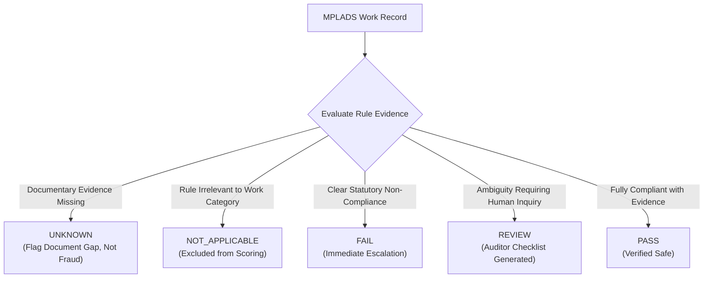

<div align="center">

# 🏛️ JanNidhi (जन निधि) — MPLADS AI Sentinel
### *Intelligent Audit Prioritization, Explainable Anomaly Detection & Public Transparency Platform*
**Ministry of Statistics and Programme Implementation (MoSPI) • Government of India**

---

[](https://python.org)
[](https://fastapi.tiangolo.com)
[](https://react.dev)
[](https://vitejs.dev)
[](https://mongodb.com)
[](https://tailwindcss.com)
[](tests/)
[](backend/auth.py)

<p align="center">
  <b>A proactive, explainable, evidence-based decision-support system analyzing 228,000+ MPLADS works to detect expenditure irregularities, contractor monopolies, duplicate claims, and statutory non-compliance.</b>
</p>

[Key Capabilities](#-key-capabilities) •
[Multi-Agent Architecture](#-multi-agent-risk-engine) •
[Statutory Rules](#-evidence-grounded-5-state-rule-system) •
[System Flow](#-system-architecture) •
[API Reference](#-public--auditor-api-reference) •
[Quick Start](#-quick-start-guide)

---

</div>

## 📌 Executive Summary

Under the **Members of Parliament Local Area Development Scheme (MPLADS)**, each MP is allocated ₹5 Crore annually to recommend developmental works in their constituencies. With hundreds of thousands of works distributed across various Implementing District Authorities (IDAs), identifying cost anomalies, delayed projects, procurement monopolization, and compliance violations requires exhaustive manual audits.

**JanNidhi (जन निधि)** modernizes this audit paradigm through:
1. **Multi-Agent Risk Synthesis:** 6 specialist AI agents examine financial flows, milestone velocities, vendor networks, text duplication, geographic clustering, and statutory guidelines.
2. **Deterministic 5-State Rule Verification:** Isolates documentary evidence gaps (`UNKNOWN`) from verified legal violations (`FAIL`), preventing false accusations.
3. **Explainable Forensic Case Packets:** Generates plain-language causal narratives, quantified impact figures (e.g. INR overrun values), and targeted auditor checklists (Measurement Books, Sanction Orders).
4. **Citizen Crowdsourced Verification:** Enables citizens to submit geo-tagged photographic feedback directly from project sites with strict MIME validation and payload protections.
5. **Open Public Governance:** Empowers citizens and journalists with transparent directories of MPs, state expenditures, category breakdowns, and rate-limited open-data exports.

> [!IMPORTANT]
> **Core Explainability Principle:**  
> JanNidhi produces **Risk Tiers (`High Risk - Review`, `Medium Risk - Monitor`, `Low Risk`)** and **Action Directives**, not criminal verdicts. An AI flag is a high-confidence decision-support triage filter; authorized human auditors retain final confirmation authority.

---

## ⚡ Key Capabilities

```
┌────────────────────────────────────────────────────────────────────────────────────────┐
│                                   PLATFORM MODULES                                     │
├──────────────────────┬──────────────────────┬───────────────────┬──────────────────────┤
│ 📊 Portfolio         │ 📋 Priority Audit    │ 🔍 Case Packet    │ 🏛️ Public MP & State │
│    Overview          │    Queue             │    Dossier        │    Directory         │
│ Macro risk tiers,    │ Dynamic prioritized  │ Multi-agent risk  │ Constituency splits, │
│ utilization gauges,  │ audit queue with     │ breakdown, rule   │ MP utilization rates,│
│ state allocation     │ instant state, MP,   │ evidence checklist│ category spend, side-│
│ charts & live KPIs.  │ and house filters.   │ & citizen reports.│ by-side comparisons. │
└──────────────────────┴──────────────────────┴───────────────────┴──────────────────────┘
```

- 🎯 **Risk-Ranked Priority Queue:** Instant triage of high-risk projects requiring urgent inspection.
- 📂 **Forensic Case Packets:** Comprehensive dossiers including statutory findings, multi-agent flags, and itemized evidence checklists.
- 👥 **Citizen Ground-Truth Reporting:** Public photo verification module with rate-limiting and metadata validation.
- ⚖️ **Auditor Review Workflow:** Server-authoritative review recording with formal determination tracking.
- 🔄 **Live Sync & Ingestion Pipeline:** Automated long-format master data ingestion secured with MongoDB distributed locking.

---

## 🤖 Multi-Agent Risk Engine

JanNidhi employs **6 specialist domain agents** governed by a central coordinator. Each agent operates on mathematically robust statistical baselines and domain heuristics configured via [`model/config.yaml`](model/config.yaml):

| Agent | Weight | Domain Focus | Key Detection Vectors |
|---|:---:|---|---|
| **💰 Financial Agent** | `25%` | Financial Outliers & Balance Integrity | Robust Median Absolute Deviation (MAD > 4.0), negative balances, disbursement mismatch (>10%), and fund release without sanction. |
| **👯 Duplicate Agent** | `22%` | Near-Duplicate & Ghost-Work Identification | Jaccard token similarity (threshold 0.72) + character bigram matching across overlapping locations, timeframes, and descriptions. |
| **⏱️ Timeline Agent** | `20%` | Stagnation & Milestone Anomalies | Overdue execution (>180 days in inactive status), disbursement post-completion (>30 days), and suspicious rapid completions (<15 days). |
| **🏢 Vendor Agent** | `15%` | Procurement Monopolies & Cartelization | Vendor concentration (>30% of state works, >60% of an MP's works), multi-MP vendor cross-billing (≥3 MPs). |
| **📜 Compliance Agent** | `13%` | Statutory Guidelines & Mandates | Prohibited works (Annexure-II), Trust/Society ₹50 Lakh single-work ceilings, and SC/ST allocation tracking. |
| **📍 Geographic Agent** | `5%` | Cluster Anomalies & IDA Capture | Implementing District Authority budget capture (>40% of state budget), IDA vendor monopolies (>80%), and multi-MP IDA clusters. |

### Consensus Scoring Pipeline
$$\text{Likelihood Score} = \sum_{i=1}^{6} w_i \cdot \text{AgentScore}_i \quad \text{where} \quad \sum w_i = 1.0$$
Works with a weighted consensus score $\ge 0.40$ are flagged as anomalous, and normalized against portfolio percentiles into actionable tiers:
- 🔴 **High Risk - Review** (`score ≥ 70.0`)
- 🟡 **Medium Risk - Monitor** (`50.0 ≤ score < 70.0`)
- 🟢 **Low Risk** (`score < 50.0`)

---

## ⚖️ Evidence-Grounded 5-State Rule System

Unlike traditional binary scanners that generate high false-positive rates, JanNidhi enforces an **evidence-grounded five-state evaluation model**:



- **`PASS`**: Full documentary evidence confirms compliance with statutory guidelines.
- **`FAIL`**: Explicit, verified violation of a statutory prohibition (e.g., fund release prior to Administrative Sanction, disbursement exceeding sanction order, Trust work exceeding ₹50 Lakh).
- **`REVIEW`**: Condition warrants auditor verification (e.g., prohibited work keywords requiring site inspection, unclassified category codes).
- **`UNKNOWN`**: Crucial statutory dates or documents are unavailable in the source data. **Treated strictly as a documentation defect, never as proof of misconduct.**
- **`NOT_APPLICABLE`**: Rule scope does not apply to this category or entity.

---

## 🏗️ System Architecture

```
                                  [ Citizen / Browser Client ]
                                               │
                                               ▼
                             ┌───────────────────────────────────┐
                             │    React 19 + Tailwind SPA UI     │
                             │  (Vite Bundled, Lucide, Chart.js) │
                             └─────────────────┬─────────────────┘
                                               │ HTTPS / REST / JWT
                                               ▼
                             ┌───────────────────────────────────┐
                             │       FastAPI Backend API         │
                             │  (Server-Side RBAC, Sliding Rate  │
                             │   Limiter, Bcrypt Auth & CORS)    │
                             └─────────┬───────────────┬─────────┘
                                       │               │
                     ┌─────────────────┴─┐           ┌─┴───────────────────┐
                     │ Multi-Agent Risk  │           │   PyMongo Ingestion  │
                     │ Engine & 5-State  │           │  & Distributed Lock │
                     │ Rule Evaluator    │           │     (TTL Index)     │
                     └─────────────────┬─┘           └─┬───────────────────┘
                                       │               │
                                       ▼               ▼
                             ┌───────────────────────────────────┐
                             │       MongoDB Atlas Cluster       │
                             │ (Works, Users, MP Allocations,    │
                             │  Public Reviews, Distributed Lock)│
                             └───────────────────────────────────┘
```

---

## 🔒 Security Architecture & Production Hardening

JanNidhi incorporates enterprise-grade security practices validated against strict attack-regression suites:

1. **Server-Authoritative Role-Based Access Control (RBAC):**
   - Client-provided privilege headers (`X-User-Role`, etc.) are unconditionally rejected.
   - User identity and permissions are strictly resolved from signed JWT Bearer tokens validated directly against MongoDB.
2. **Bcrypt Password Encryption:**
   - User passwords are encrypted with bcrypt (cost factor 12). Passwords and password hashes are stripped from all API serializations.
3. **Sliding-Window Rate Limiting:**
   - Protects authentication endpoints (`/api/auth/login` capped at 5 requests/min) to prevent brute-force attacks.
   - Public review submission (`/api/works/{id}/public-review`) and open-data export streams (`/api/export/works`) are bounded by IP rate limiters.
4. **MIME Validation & Payload Protection:**
   - Citizen photographic uploads are capped at 1.5MB, validated for real image headers (JPEG, PNG, WEBP), and sanitised to thwart script injection.
5. **Distributed Concurrency Lock:**
   - MongoDB-backed distributed lock with TTL expiration prevents concurrent portal sync execution across multiple worker processes.

---

## 📁 Repository Structure

```
project-root/
├── backend/
│   ├── audit/                      # Portfolio scanning & rescoring utilities
│   │   ├── portfolio_scanner.py    # Production batch audit scanner
│   │   └── rescore_portfolio.py    # Live field update & priority ranker
│   ├── engines/                    # Data quality defect engine
│   │   └── data_quality_engine.py  # 12-vector data defect classification
│   ├── scripts/                    # Maintenance & feed utility scripts
│   ├── services/                   # Core business logic
│   │   ├── analytics.py            # MP, State, and Portfolio aggregations
│   │   ├── ingestion.py            # Data pipeline, transformation & locking
│   │   └── mplads_live.py          # Portal session client & scraper
│   ├── auth.py                     # Bcrypt hashing, JWT tokens & rate limiters
│   ├── config.py                   # Pydantic environment configuration
│   ├── database.py                 # PyMongo connection & index initialization
│   ├── main.py                     # FastAPI application entrypoint & routing
│   ├── models.py                   # Document schemas & normalization helpers
│   ├── schemas.py                  # Pydantic request/response validation
│   └── seeder.py                   # Idempotent DB initialization & demo users
│
├── frontend/                       # React 19 + Tailwind CSS Frontend
│   ├── public/                     # Static assets, branding & icons
│   ├── src/
│   │   ├── components/             # Reusable UI & view components
│   │   │   ├── dashboard/          # Risk donut, state allocation & utilization charts
│   │   │   ├── magicui/            # Shimmer buttons, dot patterns, blur fade
│   │   │   ├── ui/                 # Accessible UI primitives (dialog, button, table, etc.)
│   │   │   ├── CasePacketModal.jsx # Forensic case packet & citizen review modal
│   │   │   ├── IndiaMap.jsx        # Interactive SVG map with color-coded utilization & compare triggers
│   │   │   ├── Header.jsx          # MoSPI branding, status pills & auth trigger
│   │   │   ├── LoginModal.jsx      # JWT credentials authentication dialog
│   │   │   ├── MPDirectory.jsx     # MP transparency table & deep filter
│   │   │   ├── MPProfileModal.jsx  # Individual MP portfolio dossier
│   │   │   ├── PortfolioOverview.jsx # Macro analytics, charts & entity cards
│   │   │   ├── PriorityQueue.jsx   # Ranked audit work triage table
│   │   │   └── StatesView.jsx      # State choropleth map & integrated side-by-side comparison
│   │   ├── lib/                    # API clients, chart configs & formatters
│   │   ├── App.jsx                 # Stateful application coordinator
│   │   ├── index.css               # Design tokens, glassmorphism & typography
│   │   └── main.jsx                # React root bootstrap
│   ├── package.json                # Frontend dependencies
│   └── vite.config.js              # Vite configuration
│
├── model/                          # Multi-Agent Risk Engine
│   ├── agents/                     # 6 Domain Specialist Agents
│   │   ├── base.py                 # Base agent abstract interface
│   │   ├── coordinator.py          # Multi-agent weighted synthesis
│   │   ├── financial_agent.py      # Financial outlier detection
│   │   ├── duplicate_agent.py      # Near-duplicate text & location detection
│   │   ├── timeline_agent.py       # Velocity & stagnation detection
│   │   ├── vendor_agent.py         # Vendor concentration detection
│   │   ├── compliance_agent.py     # Statutory guideline compliance
│   │   └── geographic_agent.py     # IDA clustering & capture detection
│   ├── rules/                      # Statutory 5-State Rule Evaluator
│   │   ├── evaluator.py            # Rule evaluation implementations
│   │   └── registry.py             # Rule registry & legal metadata
│   ├── config.yaml                 # Tunable agent weights & thresholds
│   └── risk_engine.py              # Central risk scoring & case packet generator
│
├── data/
│   └── generate_sample_feed.py     # Dynamic test feed generator
│
├── tests/                          # Automated PyTest Test Suite (82 tests)
│   ├── conftest.py                 # Isolated mongomock database fixtures
│   ├── test_api.py                 # 24 REST API integration tests
│   ├── test_ingestion_regression.py# Pipeline merge & locking tests
│   ├── test_phase_3_rules.py       # Statutory five-state rule tests
│   ├── test_phase_4_scan.py        # Algorithmic portfolio scan tests
│   ├── test_risk_engine.py         # Multi-agent scoring & drift tests
│   └── test_security_regression.py # 9-vector security attack tests
│
├── .github/workflows/              # CI/CD Automated Pipelines
│   ├── test.yml                    # Automated PyTest execution on push/PR
│   └── deploy-frontend.yml         # Frontend build verification
│
├── .env.example                    # Environment variable template
├── .gitignore                      # Git exclusion rules
├── pytest.ini                      # PyTest discovery configuration
└── requirements.txt                # Python backend dependencies
```

---

## 📡 Public & Auditor API Reference

All endpoints are hosted under `/api`. Interactive documentation is accessible via Swagger UI at `/docs` or ReDoc at `/redoc`.

| Method | Endpoint | Access Level | Description |
|:---:|---|:---:|---|
| `POST` | `/api/auth/login` | **Public** (Rate Limited) | Authenticates credentials with bcrypt, returns signed JWT Bearer token. |
| `GET` | `/api/works` | **Public** | Paginated works sorted by priority rank. Filters: `state`, `mp_name`, `house`, `risk_tier`. |
| `GET` | `/api/works/{work_id}` | **Public** | Detailed case packet: risk breakdown, plain-language causes, citizen reports. |
| `POST` | `/api/works/{work_id}/review` | **Auditor / Reviewer** | Records formal audit determination. Role validated server-side. |
| `POST` | `/api/works/{work_id}/public-review`| **Public** (Rate Limited) | Submits citizen site feedback with optional 1.5MB validated photo upload. |
| `GET` | `/api/mps` | **Public** | Complete MP fund directory: allocations, expenditure, utilization rate, risk profile. |
| `GET` | `/api/mps/{mp_name}` | **Public** | MP transparency profile: category distributions, top anomalous works. |
| `GET` | `/api/states` | **Public** | State-wise fund allocation, expenditure totals, and MP coverage summary. |
| `GET` | `/api/states/{state}` | **Public** | State-level dossier: risk tier distribution, top MPs, category breakdowns. |
| `GET` | `/api/analytics/categories` | **Public** | Overall fund share and average risk score grouped by work category. |
| `GET` | `/api/analytics/status` | **Public** | Portfolio distribution across completion statuses. |
| `GET` | `/api/export/works` | **Public** (Rate Limited) | Open-data CSV export stream (bounded at 10,000 rows). |
| `POST` | `/api/sync/run` | **Reviewer / Admin** | Triggers asynchronous portal ingestion under a distributed lock. |
| `GET` | `/api/sync/status` | **Public** | Reports ingestion status, lock state, and last synchronized timestamp. |
| `GET` | `/api/sync/logs` | **Public** | Public audit log of past synchronization runs. |
| `GET` | `/api/health` | **Public** | System health probe (MongoDB connection, document count). |

---

## 🚀 Quick Start Guide

### Prerequisites
- **Python:** 3.11 or higher
- **Node.js:** 18 or higher (with npm)
- **MongoDB:** Local MongoDB Community Server or MongoDB Atlas cluster

### 1. Clone the Repository
```bash
git clone https://github.com/poulamisingha1212-source/SIH26102.git
cd SIH26102
```

### 2. Configure Environment Variables
Create a `.env` file in the root directory (refer to `.env.example`):
```env
MONGODB_URI=mongodb://localhost:27017
MONGO_DB_NAME=mplads_sentinel
ENVIRONMENT=development
JWT_SECRET=your-super-secret-key-at-least-32-chars-long
ACCESS_TOKEN_EXPIRE_MINUTES=1440
CORS_ORIGINS=http://localhost:5173,http://localhost:3000
PORT=8000
```

### 3. Backend Setup
```bash
# Install Python dependencies
pip install -r requirements.txt -r requirements-dev.txt

# Seed initial database & demo user accounts
python -m backend.seeder

# Start the FastAPI server
uvicorn backend.main:app --host 0.0.0.0 --port 8000 --reload
```
API Documentation: `http://localhost:8000/docs`

### 4. Frontend Setup
```bash
# In a new terminal:
cd frontend

# Install dependencies
npm ci

# Start the development server
npm run dev
```
Open your browser at `http://localhost:5173`.

---

## 🧪 Automated Testing & Quality Assurance

JanNidhi includes an extensive suite of **82 automated tests** covering security vectors, statutory rules, multi-agent math, and REST API integration:

```bash
# Run the complete test suite:
pytest -v

# Run with short traceback:
pytest -v --tb=short

# Run specific test modules:
pytest tests/test_security_regression.py -v   # RBAC, injection, rate limiting
pytest tests/test_phase_3_rules.py -v         # Statutory 5-state logic
pytest tests/test_risk_engine.py -v           # Multi-agent scoring & drift
pytest tests/test_api.py -v                   # REST endpoints & directories
```

*Note: Tests run against an isolated in-memory `mongomock` instance and automatically synthesize test fixtures, ensuring zero side-effects on production data.*

---

## 👥 Demo User Credentials

For demonstration and audit workflow evaluation:

| Role | Username | Password | Permissions |
|---|---|---|---|
| **Public User** | *(No login required)* | *(None)* | View priority queue, MP directories, case packet narratives, submit citizen feedback, export open data. |
| **Auditor** | `auditor` | `Auditor@MPLADS2026!` | All public access + Submit formal audit determinations on case packets. |
| **Admin / Reviewer**| `admin` | `Admin@MPLADS2026!` | All auditor access + Trigger live portal data synchronization. |

---

## 📜 License & Compliance

Developed for the **Ministry of Statistics and Programme Implementation (MoSPI)** under the **Smart India Hackathon (SIH)** initiative.  
All data schemas and compliance rules are aligned with the official **MPLADS Scheme Guidelines (2023)** issued by the Government of India.
